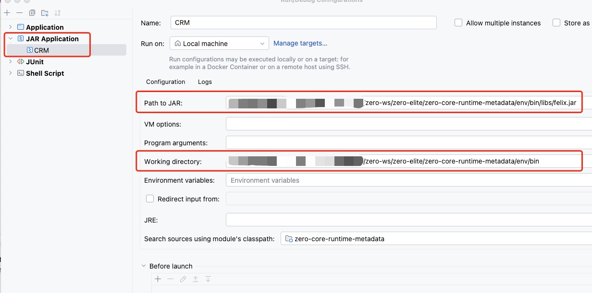

# OSGI 模块开发

## 1. 项目说明

```bash
# 环境初始化（若 submodule 有更新则同样执行此操作）
mvn -Pdev clean package install
# Bundle 编译
mvn clean package install
# 注意 Bundle 编译会直接清空 dev/bin/cache 和 dev/bin/logs
```

## 2. SubModule 检查

```bash
# 若是第一次使用，检查是否在 GIT 中存在 SubModule
git submodule
...... refs/Zero.Rapid.Build.Runtime (heads/master)
# 存在时执行 mvn -Pdev clean package install 才有效
```

## 3. 调试



| 参数                  | 说明                                      |
|---------------------|-----------------------------------------|
| 项目类型                | JAR Application                         |
| `Path to JAR`       | `felix.jar` 的路径（ 定制过 ）                  |
| `Working directory` | `env/bin` 环境路径，`env` 目录中的内容会被 Maven 初始化 | 

> 保存直接使用 IDEA 运行，就可以打断点调试当前 `Bundle` 了。

## 4. 运行结果

```bash
[Zero] Rapid Fabric OSGI Environment Booting...
____________________________
Welcome to Apache Felix Gogo

g! 14:08:44.523 | I | FelixStartLevel                | [ μηδέν ]  [ Zero ]  ( Exception ) "231" errors has been added to the Store. | io.zerows.core.metadata.store.OCacheFailure 
14:08:44.524 | I | FelixStartLevel                | [ μηδέν ]  [ Zero ]  ( Service ) The service "class io.zerows.core.metadata.osgi.service.ExceptionDeskService" of "interface io.zerows.core.metadata.osgi.service.ExceptionDesk" has been registered successfully! | io.zerows.core.metadata.osgi.CoreMetadataDependency 
14:08:44.528 | I | FelixStartLevel                | [ μηδέν ]  [ Zero ]  ( Bundle ) The bundle 「io.zerows.zero-core-runtime-metadata」 has been started successfully! | io.zerows.core.metadata.osgi.CoreMetadataActivator 
```